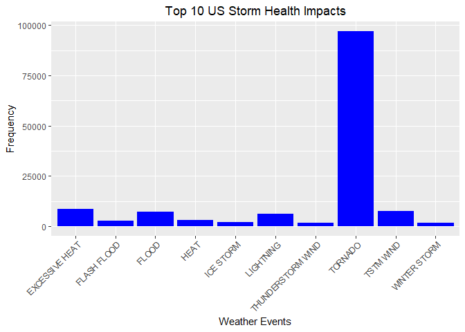

#IMPACT OF SEVERE WEATHER EVENTS IN THE UNITED STATES

##Synopsis

This project involves exploring the U.S. National Oceanic and Atmospheric Administrations's (NOAA) storm database. This database tracks characteristics of major storms and weather events in the United States, including when and where they occur, as well as estimates of any fatalities, injuries, and property damage.

The events in the database start in the year 1950 and end in November 2011. In the earlier years of the database there are generally fewer events recorded, most likely due to a lack of good records. More recent years should be considered more complete.

The aim of the analysis is to determine which types of events are most harmful with respects to population health and which types of events have the greatest economic consequences.

##Data Processing

Load the data from the working directory, which was downloaded from [Storm Data](https://d396qusza40orc.cloudfront.net/repdata%2Fdata%2FStormData.csv.bz2).


```r
library(ggplot2)
```

```
## Warning: package 'ggplot2' was built under R version 3.5.2
```

```r
library(formattable)
```

```
## Warning: package 'formattable' was built under R version 3.5.2
```

```r
stormData<-read.csv(bzfile("repdata_data_StormData.csv.bz2"))
```

Review the data to get an idea of its structure.


```r
head(stormData)
```

```
##   STATE__           BGN_DATE BGN_TIME TIME_ZONE COUNTY COUNTYNAME STATE
## 1       1  4/18/1950 0:00:00     0130       CST     97     MOBILE    AL
## 2       1  4/18/1950 0:00:00     0145       CST      3    BALDWIN    AL
## 3       1  2/20/1951 0:00:00     1600       CST     57    FAYETTE    AL
## 4       1   6/8/1951 0:00:00     0900       CST     89    MADISON    AL
## 5       1 11/15/1951 0:00:00     1500       CST     43    CULLMAN    AL
## 6       1 11/15/1951 0:00:00     2000       CST     77 LAUDERDALE    AL
##    EVTYPE BGN_RANGE BGN_AZI BGN_LOCATI END_DATE END_TIME COUNTY_END
## 1 TORNADO         0                                               0
## 2 TORNADO         0                                               0
## 3 TORNADO         0                                               0
## 4 TORNADO         0                                               0
## 5 TORNADO         0                                               0
## 6 TORNADO         0                                               0
##   COUNTYENDN END_RANGE END_AZI END_LOCATI LENGTH WIDTH F MAG FATALITIES
## 1         NA         0                      14.0   100 3   0          0
## 2         NA         0                       2.0   150 2   0          0
## 3         NA         0                       0.1   123 2   0          0
## 4         NA         0                       0.0   100 2   0          0
## 5         NA         0                       0.0   150 2   0          0
## 6         NA         0                       1.5   177 2   0          0
##   INJURIES PROPDMG PROPDMGEXP CROPDMG CROPDMGEXP WFO STATEOFFIC ZONENAMES
## 1       15    25.0          K       0                                    
## 2        0     2.5          K       0                                    
## 3        2    25.0          K       0                                    
## 4        2     2.5          K       0                                    
## 5        2     2.5          K       0                                    
## 6        6     2.5          K       0                                    
##   LATITUDE LONGITUDE LATITUDE_E LONGITUDE_ REMARKS REFNUM
## 1     3040      8812       3051       8806              1
## 2     3042      8755          0          0              2
## 3     3340      8742          0          0              3
## 4     3458      8626          0          0              4
## 5     3412      8642          0          0              5
## 6     3450      8748          0          0              6
```

Subset the data using only the variables required to determine which types of events are most harmful with respects to populaion health and which types of events have the greatest economic consequences. Keep only those observations which resulted in either fatalities, injuries, property damage, or crop damage.

Convert all of the alphabetic observations in the PROPDMGEXP and CROPDMGEXP variables to uppercase.

Lastly, convert all of the observations in the PROPDMGEXP and CROPDMGEXP variables to their numeric equivalents.


```r
healthSub<-subset(stormData, FATALITIES>0 | INJURIES>0, select = c("EVTYPE", "FATALITIES", "INJURIES"))

damageSub<-subset(stormData, PROPDMG>0 | CROPDMG>0, select = c("EVTYPE", "PROPDMG", "PROPDMGEXP", "CROPDMG", "CROPDMGEXP"))

damageSub$PROPDMGEXP<-toupper(damageSub$PROPDMGEXP)
damageSub$CROPDMGEXP<-toupper(damageSub$CROPDMGEXP)

PropDmgMultiple<-c("-"=1, "+"=1, "0"=1, "2"=100, "3"=1000, "4"=10000, "5"=100000, "6"=1000000, "7"=10000000, "H"=100, "K"=1000, "M"=1000000, "B"=1000000000)

damageSub$PROPDMGEXP<-PropDmgMultiple[as.character(damageSub$PROPDMGEXP)]

CropDmgMultiple<-c("?"=0, "0"=1, "K"=1000, "M"=1000000, "B"=1000000000)

damageSub$CROPDMGEXP<-CropDmgMultiple[as.character(damageSub$CROPDMGEXP)]
```

The fatalities and injuries are summarized according to event type and totaled. The data frame is then sorted  in descending order based on the total column, retaining only the top ten results.

The property and crop damage figures are multiplied by their corresponding exponents. The products are summarized according to event type and totaled. The data frame is then sorted in descending order based on the total column, retaining only the top ten results.


```r
healthImpact<-setNames(aggregate(cbind(FATALITIES, INJURIES)~EVTYPE, data = healthSub, sum), c("EVTYPE", "Fatalities", "Injuries"))
healthImpact$Total<-healthImpact$Fatalities + healthImpact$Injuries
healthTopTen<-healthImpact[order(healthImpact$Total, decreasing = TRUE),][1:10,]

damageSub$PropTotal<-damageSub$PROPDMG * damageSub$PROPDMGEXP

damageSub$CropTotal<-damageSub$CROPDMG * damageSub$CROPDMGEXP

propImpact<-setNames(aggregate(cbind(PropTotal, CropTotal)~EVTYPE, data = damageSub, sum), c("EventType", "PropTotal", "CropTotal"))
propImpact$Total<-propImpact$PropTotal + propImpact$CropTotal
propTopTen<-propImpact[order(propImpact$Total, decreasing = TRUE),][1:10,]
```

##Results

The weather events having the greatest impact on human health are tornados as dispayed on the below bar plot.


```r
ggplot(data = healthTopTen, aes(x = EVTYPE, y = Total)) + geom_bar(stat = "identity", fill = "blue") + xlab("Weather Events") + ylab("Frequency") + ggtitle("Top 10 US Storm Health Impacts") + theme(plot.title = element_text(hjust = 0.5), axis.text.x = element_text(angle = 45, hjust = 1))
```

<!-- -->

As displayed in the below table, floods have the most economic impact of the weather events observed.


```r
DF<-data.frame(Event_Type=propTopTen$EventType, Property_Damage=accounting(propTopTen$PropTotal), Crop_Damage=accounting(propTopTen$CropTotal), Total_Damage=accounting(propTopTen$Total))
formattable(DF)
```


<table class="table table-condensed">
 <thead>
  <tr>
   <th style="text-align:right;"> Event_Type </th>
   <th style="text-align:right;"> Property_Damage </th>
   <th style="text-align:right;"> Crop_Damage </th>
   <th style="text-align:right;"> Total_Damage </th>
  </tr>
 </thead>
<tbody>
  <tr>
   <td style="text-align:right;"> FLOOD </td>
   <td style="text-align:right;"> 132,836,489,050.00 </td>
   <td style="text-align:right;"> 5,170,955,450.00 </td>
   <td style="text-align:right;"> 138,007,444,500.00 </td>
  </tr>
  <tr>
   <td style="text-align:right;"> HURRICANE/TYPHOON </td>
   <td style="text-align:right;"> 26,740,295,000.00 </td>
   <td style="text-align:right;"> 2,607,872,800.00 </td>
   <td style="text-align:right;"> 29,348,167,800.00 </td>
  </tr>
  <tr>
   <td style="text-align:right;"> TORNADO </td>
   <td style="text-align:right;"> 16,166,946,743.00 </td>
   <td style="text-align:right;"> 403,379,620.00 </td>
   <td style="text-align:right;"> 16,570,326,363.00 </td>
  </tr>
  <tr>
   <td style="text-align:right;"> HURRICANE </td>
   <td style="text-align:right;"> 9,716,358,000.00 </td>
   <td style="text-align:right;"> 2,688,910,000.00 </td>
   <td style="text-align:right;"> 12,405,268,000.00 </td>
  </tr>
  <tr>
   <td style="text-align:right;"> RIVER FLOOD </td>
   <td style="text-align:right;"> 5,079,635,000.00 </td>
   <td style="text-align:right;"> 5,028,734,000.00 </td>
   <td style="text-align:right;"> 10,108,369,000.00 </td>
  </tr>
  <tr>
   <td style="text-align:right;"> HAIL </td>
   <td style="text-align:right;"> 7,994,788,690.00 </td>
   <td style="text-align:right;"> 2,053,807,900.00 </td>
   <td style="text-align:right;"> 10,048,596,590.00 </td>
  </tr>
  <tr>
   <td style="text-align:right;"> FLASH FLOOD </td>
   <td style="text-align:right;"> 7,328,496,127.00 </td>
   <td style="text-align:right;"> 1,388,029,050.00 </td>
   <td style="text-align:right;"> 8,716,525,177.00 </td>
  </tr>
  <tr>
   <td style="text-align:right;"> ICE STORM </td>
   <td style="text-align:right;"> 903,037,350.00 </td>
   <td style="text-align:right;"> 5,022,113,500.00 </td>
   <td style="text-align:right;"> 5,925,150,850.00 </td>
  </tr>
  <tr>
   <td style="text-align:right;"> STORM SURGE/TIDE </td>
   <td style="text-align:right;"> 4,640,643,000.00 </td>
   <td style="text-align:right;"> 850,000.00 </td>
   <td style="text-align:right;"> 4,641,493,000.00 </td>
  </tr>
  <tr>
   <td style="text-align:right;"> THUNDERSTORM WIND </td>
   <td style="text-align:right;"> 3,398,942,440.00 </td>
   <td style="text-align:right;"> 414,705,550.00 </td>
   <td style="text-align:right;"> 3,813,647,990.00 </td>
  </tr>
</tbody>
</table>
